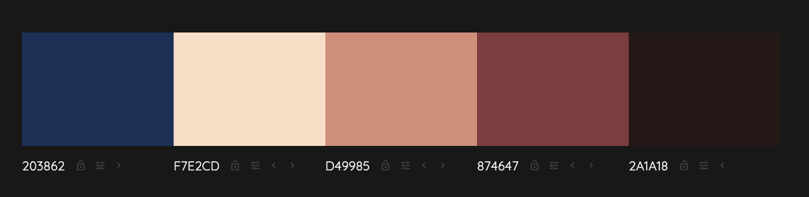
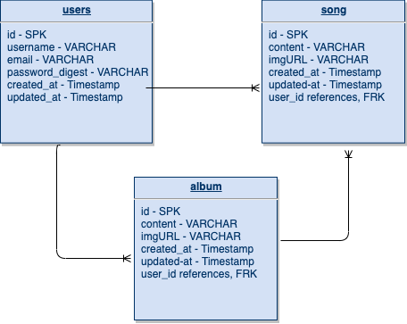

# PROJECT 4 README

<br>

## Overview

**Project Title** My Melody is an app that allows users to track their favorite songs and albums. They can edit, update, and delete these entries and then view the most popular artists among all users across the platform. 

<br>

## MVP

> The Minimum Viable Product should be a well-planned, easily-communicated product, ensuring that the client's deliverable will be achievable and meet specifications within the time frame estimated.

 *Create User
 *View, Create, Edit, and Delete Song Posts
 *View, Create, Edit, and Delete Album Posts

<br>

### Goals

*Create a full-stack, full-CRUD app with really nice, sleek styling

<br>

### Libraries and Dependencies

> Use this section to list all supporting libraries and dependencies, and their role in the project. Below is an example - this needs to be replaced!

|     Library      | Description                                |
| :--------------: | :----------------------------------------- |
|      React       | JavaScript library|
|   React Router   | A tool that allows you to handle routes in a web app, using dynamic routing|
| React Material UI | React UI framework that will help in the creation of a navigation bar and various buttons |
|     CORS      | allow for requests from outside domains|
|     Rails      | back-end framework |

<br>

### Client (Front End)

#### Wireframes

Wireframes on Figma

https://www.figma.com/file/Rkt1PALvbv5V0gKQVreX2i/My-Melody-Wireframes?node-id=0%3A1


#### Color Scheme from http://colormind.io/:




#### Component Tree

> Use this section to display the structure of how your React components are being rendered. This should show the parent to child relation between you components. In other words, show which components are rendering the other components. 

#### Component Hierarchy

> Use this section to define your React components and the data architecture of your app. This should be a reflection of how you expect your directory/file tree to look like. 

``` structure

src
|__ assets/
      |__ fonts
      |__ images
|__ client
      |__App.jsx
      |__Index.jsx
      |__src/
            |__components/
                  |__Header.jsx
            |__containers/
                  |__MainContainer.jsx
            |__screens/
                  |__Login.jsx
                  |__Registration.jsx
                  |__MainLanding.jsx
                  |__CreateSong.jsx
                  |__EditDeleteSong.jsx
                  |__CreateAlbum.jsx
                  |__EditDeleteAlbum.jsx
                  |__Favorites.jsx
                  |__Charts.jsx
                  
|__ services/
      |__apiConfig.js
      |__auth.js
      |__users.js
      |__songs.js
      |__albums.js

```

#### Component Tree

> Use this section to include a link to your component tree.

[Component tree](url)

#### Time Estimates

> Use this section to estimate the time necessary to build out each of the components you've described above.

| Task                | Priority | Estimated Time | Time Invested | Actual Time |
| ------------------- | :------: | :------------: | :-----------: | :---------: |
| Add Contact Form    |    L     |     3 hrs      |     2 hrs     |    3 hrs    |
| Create CRUD Actions |    H     |     3 hrs      |     1 hrs     |     TBD     |
| TOTAL               |          |     6 hrs      |     3 hrs     |     TBD     |


<br>

### Server (Back End)

#### ERD Model



<br>

***

## Post-MVP

> 
*Edit and Delete User
*View top artists across the platform regardless of user 
* Choose a drop-down to view rankings of most popular songs and albums as well
* View other users profiles
* Animations

***

## Code Showcase

> Use this section to include a brief code snippet of functionality that you are proud of and a brief description.

## Code Issues & Resolutions

> Use this section to list of all major issues encountered and their resolution.

